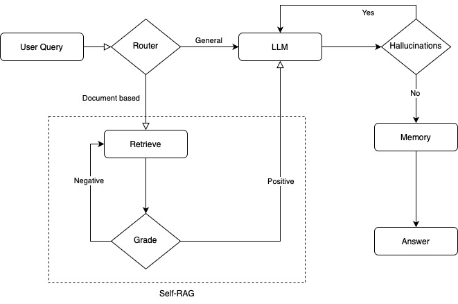

To do:
- [x] Add router
- [ ] Enhance rule-based classification obtaining medical keywords from the guidelines
- [ ] Add retrieval (Router → Retrieve)
- [ ] Add generation with llama3.2,1b (Router → Retrieve → Generate)
- [ ] Add self assessment (Router → Retrieve → Assessment → Generate)
- [ ] Add memory (Router → Retrieve → Assessment → Generate → Memory)

