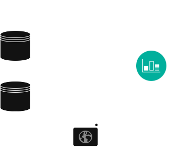

# Agentic RAG Pipeline for Cardiology Protocols

<div align="center">
  
</div>

An intelligent multi-agent system for querying European Society of Cardiology (ESC) guidelines using advanced RAG (Retrieval-Augmented Generation) techniques with self-reflection and conversational capabilities.


## 🏥 Overview

This project implements a sophisticated agentic RAG system specifically designed for medical professionals and students working with cardiology protocols. The system intelligently routes queries, retrieves relevant ESC guidelines, and provides accurate, evidence-based responses while maintaining conversational context.

### Key Features

- **🎯 Intelligent Query Routing**: Automatically classifies queries as conversational or medical
- **🔍 Self-RAG Architecture**: Self-reflecting retrieval with quality assessment and regeneration
- **💬 Conversational Agent**: Handles greetings, farewells, and general conversation naturally
- **🧠 Memory Management**: Maintains conversation context while managing token limits
- **📚 ESC Guidelines Integration**: Direct access to European Society of Cardiology protocols
- **🔄 State Management**: Robust state tracking across the entire conversation flow

## 📁 Project Structure

```
agentic-rag/
├── Makefile                    # Build automation and shortcuts
├── README.md                   # This documentation
├── requirements.txt            # Python dependencies
├── agent/                      # Core agent implementations
│   ├── router.py              # Query classification agent
│   ├── rag.py           # Self-reflecting RAG agent
│   ├── conversational_agent.py # Social interaction agent
│   ├── memory.py             # Memory management agent
│   ├── state.py              # Shared state definitions
│   ├── agent.py       # Main system agent
│   └── chainlit.md           # Chainlit configuration
└── images/                    # Architecture diagrams
    ├── cardiology-agent-dark.drawio.png
    ├── cardiology-agent-light.drawio.png
    └── cardiology-agent-transparent.drawio.png
```

## 🏗️ Architecture

The system consists of several specialized agents working together:

### Agent Details

- **Router Agent** (`router.py`): Classifies incoming queries using both LLM and rule-based approaches
- **Self-RAG Agent** (`rag.py`): Handles medical queries with retrieval, generation, and self-assessment
- **Conversational Agent** (`conversational_agent.py`): Manages social interactions and system information
- **Memory Manager** (`memory.py`): Maintains conversation context and manages token limits
- **State Manager** (`state.py`): Defines the shared state structure across all agents

## 🚀 Quick Start

### Prerequisites

- Python 3.8+
- Ollama with required models
- Qdrant vector database (from data-etl pipeline)
- ESC protocols data (processed through data-etl)

### One-Command Setup

```bash
# Clone and setup everything
git clone https://github.com/your-org/agentic-rag.git
cd agentic-rag
make install
make run
```

This will:
1. Install all dependencies
2. Run the agent in interactive mode

**Important**: remember to start the vectorstore separately for better control

## 🔍 Agent Functionality

### Router Agent

**Purpose**: Intelligent query classification
- **LLM Classification**: Uses Llama models for semantic understanding
- **Rule-based Fallback**: Medical keyword detection and pattern matching
- **Categories**: `conversational` vs `document_based`

```python
# Example usage
router = Router()
query_type = router.classify_query("What is the protocol for heart failure?")
# Returns: "document_based"
```

### Self-RAG Agent

**Purpose**: Medical query processing with self-reflection
- **Retrieval Loop**: Multiple attempts with query reformulation
- **Generation Loop**: Self-assessment and regeneration
- **Quality Gates**: Relevance, hallucination, and adequacy checking

```python
# Example usage
rag = RAG(vectorstore)
state = {"messages": [HumanMessage(content="ESC heart failure guidelines?")]}
result = rag.RAG_node(state)
```

### Conversational Agent

**Purpose**: Natural conversation handling
- **Template Responses**: Pre-defined responses for common patterns
- **Contextual Generation**: LLM-based responses for complex conversations
- **Edge Case Handling**: Graceful handling of unclear or short inputs

```python
# Example usage
conv_agent = ConversationalAgent()
state = {"messages": [HumanMessage(content="Hello!")]}
result = conv_agent.conversational_agent_node(state)
```

### Memory Manager

**Purpose**: Context preservation and token management
- **Medical Entity Extraction**: Preserves important clinical information
- **Conversation Summarization**: LLM-based summarization of longer conversations
- **Token Estimation**: Automatic cleanup when approaching limits

```python
# Example usage
memory = Memory(max_tokens=2000)
updated_state = memory.memory_management_node(state)
```

## 🎯 State Management

The system uses a centralized state object that flows between agents:

```python
class State(TypedDict):
    # Core conversation
    messages: List[BaseMessage]
    
    # Routing information  
    query_type: Optional[str]
    
    # Response generation
    response: Optional[str]
    
    # Memory management
    context: Optional[Dict[str, Any]]
    conversation_summary: Optional[str]
    
    # RAG-specific
    documents: Optional[List[Document]]
    
    # Metadata and tracking
    metadata: Optional[Dict[str, Any]]
    retrieval_attempts: Optional[int]
    generation_attempts: Optional[int]
```

## 🧪 Testing

Each agent includes comprehensive testing capabilities:

```bash
# Run all tests
make test

# Test individual components
make test-router      # Router classification tests
make test-RAG     # Self-RAG pipeline tests  
make test-conv        # Conversation tests
make test-memory      # Memory management tests
```

**System Health Check**
```bash
# Complete system status
make status

# Clean up if needed
make clean
```

## 📄 License

This project is licensed under the MIT License - see the [LICENSE](LICENSE) file for details.

